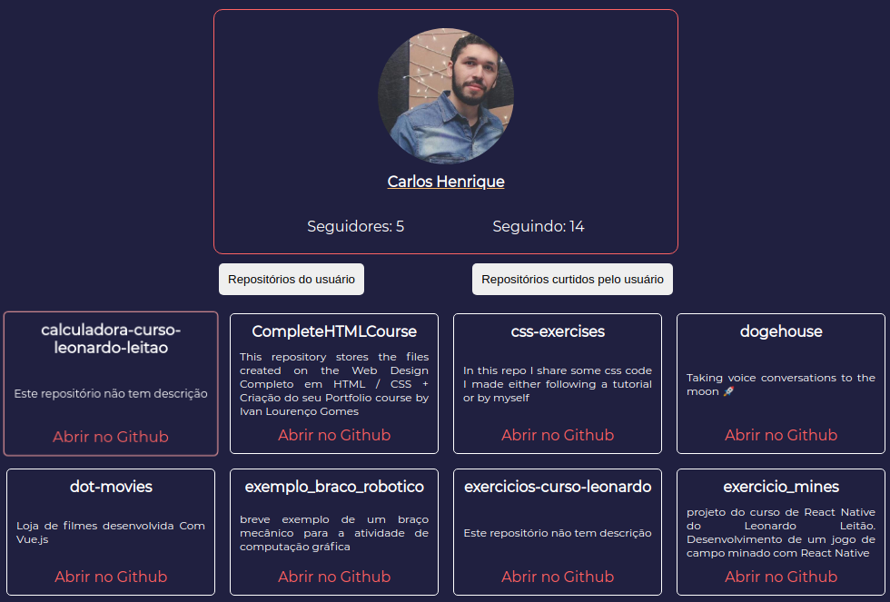

# Git Search

## Sobre o projeto
Webapp para busca de usuários do github e visualização dos seus repositórios desenvolvido em ``React``.

## Online no netlify
[Clique aqui para acessar o projeto no netlify](https://romantic-elion-6824a7.netlify.app/)


## Rodando o projeto
Instale as dependências do projeto rodando o comando:
```
yarn
```
Para rodar os testes, o comando:
```
yarn test
```
Depois inicie o servidor com o comando:
```
yarn start
```

#### Bibliotecas utilizadas
- [Axios](https://github.com/axios/axios) ;
- [Sass](https://sass-lang.com/)


# Screenshots

## Resultado bem sucedido

## Lista de repositórios do usuário encontrado

## Usuário não encontrado

